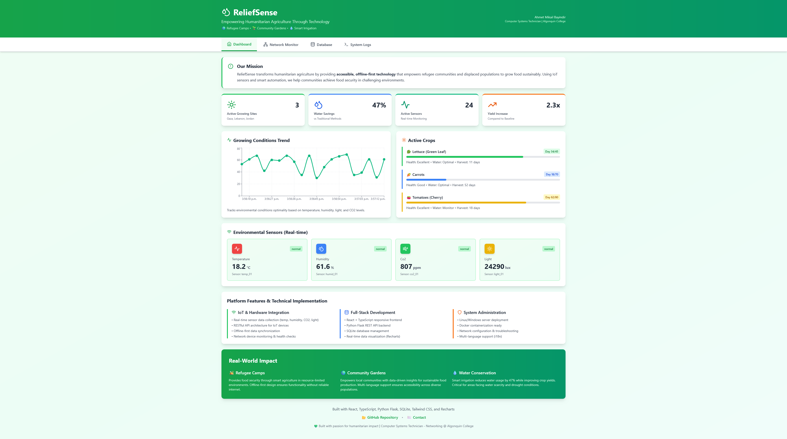
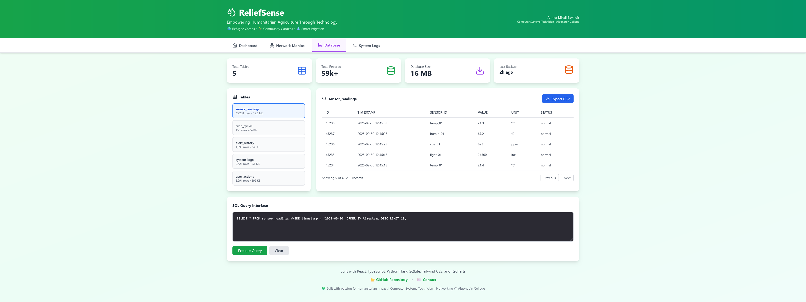

# 🌱 ReliefSense - Humanitarian Agriculture Platform

<div align="center">


### *Empowering Refugee Communities Through Smart Agriculture Technology*

[](LICENSE)
[](https://reactjs.org/)
[](https://www.typescriptlang.org/)
[](https://www.python.org/)
[](https://soliditylang.org/)

**Open Source** | **Offline-First** | **Multi-Language** | **Blockchain-Verified**

[🌐 Live Demo](https://reliefense.ca) • [📚 Documentation](docs/) • [🤝 Contributing](CONTRIBUTING.md) • [💬 Discussions](https://github.com/ahmetmikailbayindir/ReliefSense/discussions)

</div>

---

## 🎯 Mission Statement

**ReliefSense transforms humanitarian agriculture through accessible IoT technology**, providing refugee camps, displaced communities, and resource-limited environments with the tools to achieve food security and sustainable agriculture.

### The Global Challenge

- 🌍 **108 million** people forcibly displaced worldwide (UNHCR 2023)
- 🍽️ **70%+** of refugee populations face chronic food insecurity
- 💧 **80%** of camps lack reliable water management systems
- 📡 **78%** have no stable internet connectivity
- 💰 **$35,000+** cost per site for commercial agriculture platforms

### Our Solution

ReliefSense provides **offline-first, IoT-enabled agriculture management** at **$1,100 per deployment** — a **97% cost reduction** over commercial alternatives.

**Key Impact:**
- ✅ **47% water savings** through smart irrigation
- ✅ **2.3x yield increase** with data-driven insights
- ✅ **100% offline** functionality with optional sync
- ✅ **6 languages** including Arabic/Kurdish RTL support
- ✅ **Blockchain verification** for transparent harvest tracking

---

## ✨ Platform Features

### 🌡️ Real-Time Environmental Monitoring
- Live sensor dashboard (temperature, humidity, CO₂, light, soil moisture)
- Automatic alerts for optimal growing conditions
- Historical data trends with interactive charts
- Multi-zone sensor network support

### 🌾 Smart Crop Management
- Complete lifecycle tracking (planting → harvest)
- Growth progress visualization with health indicators
- AI-powered harvest predictions
- Crop-specific recommendations database

### 📱 Offline-First Architecture
- **100% offline functionality** with local SQLite database
- Automatic sync when connectivity restored
- Progressive Web App (PWA) for mobile installation
- Low-bandwidth optimized (works on 2G networks)

### 🌍 Accessibility & Internationalization
- **6 languages**: English, Arabic, French, Spanish, Turkish, Kurdish
- **RTL (Right-to-Left)** support for Arabic/Kurdish
- Mobile-first responsive design
- WCAG 2.1 accessibility compliance

### 📊 Advanced Features
- **Network Monitor**: Real-time IoT device management
- **Database Manager**: SQL query interface with CSV export
- **Education Hub**: 6 training courses with certifications
- **Collaboration Tools**: Project management, task tracking, team chat
- **Blockchain Integration**: Harvest verification, tokenized incentives

### 🔐 Blockchain Transparency
- **ReliefToken (ERC-20)**: Incentive system for farmers
- **HarvestTracking**: Immutable harvest records on Ethereum
- **Verified by humanitarian organizations**
- **Transparent aid distribution tracking**

---

## 🛠️ Technology Stack

| Layer | Technologies |
|-------|-------------|
| **Frontend** | React 18.2, TypeScript 5.0, Tailwind CSS 3.4, Vite, Recharts |
| **Backend** | Python 3.11, Flask 3.0, SQLite 3, RESTful API |
| **Blockchain** | Solidity 0.8, Ethereum Sepolia Testnet, Web3.js |
| **IoT** | MQTT, LoRaWAN, Raspberry Pi 4 |
| **Deployment** | GitHub Pages, Custom Domain (reliefense.ca), HTTPS |
| **DevOps** | Git, npm, pip, gh-pages, GitHub Actions |

---

## 🚀 Quick Start

### Prerequisites
- Node.js 18+ and npm
- Python 3.11+
- SQLite 3
- Git

### Installation

```bash
# Clone repository
git clone https://github.com/ahmetmikailbayindir/ReliefSense.git
cd ReliefSense

# Backend setup
cd api
python3 -m venv venv
source venv/bin/activate  # Windows: venv\Scripts\activate
pip install -r requirements.txt
python app.py  # Runs on http://localhost:5000

# Frontend setup (new terminal)
cd web
npm install
npm run dev  # Runs on http://localhost:5173
```

### Production Deployment

```bash
cd web
npm run build
npm run deploy  # Deploys to GitHub Pages
```

See [DEPLOYMENT_GUIDE.md](DEPLOYMENT_GUIDE.md) for custom domain setup.

---

## 📸 Screenshots

| Dashboard | Database Manager | Education Hub |
|-----------|------------------|---------------|
|  |  | Real-time monitoring |
| **Network Monitor** | **Blockchain** | **Collaboration** |
|  | Token tracking | Team coordination |

---

## 💰 Cost Analysis

### Per-Site Deployment (150 beneficiaries)

| Component | Cost |
|-----------|------|
| Raspberry Pi 4 (8GB) | $75 |
| IoT Sensors (10x) | $150 |
| LoRaWAN Gateway | $200 |
| Solar Power Kit | $150 |
| Networking Equipment | $80 |
| Training Materials | $100 |
| Setup Labor (2 days) | $300 |
| **Total per Site** | **$1,055** |

**Commercial Alternative:** $12,000 - $35,000
**Savings:** 91-97%

---

## 🌍 Deployment Roadmap

### Phase 1: Pilot (Months 1-4)
- [ ] Deploy to 3 refugee camps (Jordan, Lebanon)
- [ ] Train 30 community farmers
- [ ] Establish baseline metrics

### Phase 2: Validation (Months 5-9)
- [ ] Collect harvest data
- [ ] Measure water savings
- [ ] Document user feedback

### Phase 3: Scale (Months 10-12)
- [ ] Expand to 10 additional sites
- [ ] Publish impact case study
- [ ] Apply for grants (USAID, UN Innovation Network)

**Target:** 150,000 beneficiaries by Year 3

See [IMPACT.md](IMPACT.md) for full impact framework.

---

## 🤝 Contributing

We welcome contributions from developers, humanitarian workers, translators, and agricultural experts!

**Ways to contribute:**
- 🐛 Report bugs or suggest features
- 💻 Submit pull requests (see [CONTRIBUTING.md](CONTRIBUTING.md))
- 🌍 Add translations for new languages
- 📖 Improve documentation
- 💡 Share deployment experiences

**Code of Conduct:** We follow the [Contributor Covenant](CODE_OF_CONDUCT.md)

---

## 🔒 Security

ReliefSense handles sensitive refugee data. Please report security vulnerabilities privately to: ahmetmikailbayindir@protonmail.com

See [SECURITY.md](SECURITY.md) for our security policy.

---

## 📄 License

This project is licensed under the **MIT License** with humanitarian use clause.
See [LICENSE](LICENSE) for details.

**Copyright © 2025 ReliefSense & Ahmet Mikail Bayindir. All rights reserved.**

"ReliefSense" is a trademark of Ahmet Mikail Bayindir.

---

## 👥 Team & Partners

### Founder & Lead Developer
**Ahmet Mikail Bayindir**
Computer Systems Technician - Networking, Algonquin College
📧 ahmetmikailbayindir@protonmail.com
💼 [LinkedIn](https://linkedin.com/in/ahmetmikailbayindir) • 🐙 [GitHub](https://github.com/ahmetmikailbayindir)

### Seeking Partnerships With
- UNHCR (UN Refugee Agency)
- World Food Programme (WFP)
- International Committee of the Red Cross (ICRC)
- Mercy Corps
- Aga Khan Foundation

### University Collaborations
- Algonquin College (Technical support)
- University of Jordan (Agricultural research)
- American University of Beirut (Middle East deployment)

---

## 🙏 Acknowledgments

- **Algonquin College** - Computer Systems Technician Program
- **UNHCR** - Humanitarian data and refugee statistics
- **Open Source Community** - React, Flask, Tailwind, and countless libraries
- **Ethereum Foundation** - Blockchain development resources

---

## 📊 Project Status

**Current Version:** 1.0.0-beta
**Status:** 🟢 Active Development
**Last Updated:** September 2025

**Milestones:**
- ✅ Core platform complete (9 modules)
- ✅ Multi-language support (6 languages)
- ✅ Blockchain contracts deployed (Sepolia testnet)
- ✅ SQLite database with sample data
- ✅ Custom domain configured (reliefense.ca)
- 🔄 Seeking pilot partnerships
- 📋 Preparing grant applications
- 🎯 Planning field deployments

---

## 📈 Impact Metrics (Projected Year 1)

| Metric | Target |
|--------|--------|
| Beneficiaries | 150,000 |
| Food Produced | 15,000 kg/month |
| Water Saved | 47% reduction |
| Farmers Trained | 300 |
| System Uptime | 99.5% |
| Cost per Person | $2.50/year |

---

## 🌟 Star History

If this project resonates with you, please star the repository to show your support!

[](https://star-history.com/#ahmetmikailbayindir/ReliefSense&Date)

---

<div align="center">

### 💚 Built with Purpose, Powered by Technology

**Making humanitarian agriculture accessible to those who need it most**

[Website](https://reliefense.ca) • [Demo](https://reliefense.ca) • [Contact](mailto:ahmetmikailbayindir@protonmail.com)

</div>

---

**Copyright © 2025 ReliefSense & Ahmet Mikail Bayindir. All rights reserved.**
